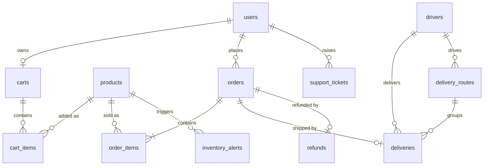
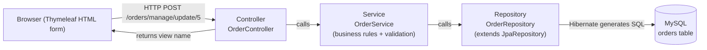

# 🎓 Lanka Fresh Mart — Viva Preparation Guide

> **Group:** 2026-Y2-S1-MLB-B1G1-02 · **Stack:** Spring Boot 3 · Spring Data JPA (Hibernate) · Spring Security · Thymeleaf · MySQL
> **Database schema:** `lanka_fresh_mart` · **App URL:** http://localhost:8080 · **Password for all test accounts:** `password123`

This guide answers the questions the examiner is most likely to ask:

1. **What is your part?** → [Section 3](#3-member-parts--files-crud-validation-sql)
2. **Which files are yours / where does CRUD happen?** → CRUD map table in each member section
3. **Where is your validation?** → "Validation" table in each member section
4. **Did you use design patterns? Show them in the code.** → [Section 4](#4-design-patterns-lecture-patterns-mapped-to-our-code)
5. **Show your table CRUD in MySQL Workbench.** → "MySQL Workbench proof" in each member section + [Section 5](#5-mysql-workbench--how-to-show-crud-live)

> [!CAUTION]
> Read [Section 7 — Gaps to fix before the viva](#7-%EF%B8%8F-gaps-to-fix-before-the-viva) first. After the UI redesign, some **Delete / Update buttons no longer appear on screen**, even though the backend code for them still exists. The examiner will ask you to demo all four CRUD operations.

---

## Table of Contents

- [0. Pre-viva checklist (10 minutes before)](#0-pre-viva-checklist-10-minutes-before)
- [1. Project at a glance](#1-project-at-a-glance)
- [2. Architecture — how one request flows](#2-architecture--how-one-request-flows)
- [3. Member parts — files, CRUD, validation, SQL](#3-member-parts--files-crud-validation-sql)
  - [3.1 Order Management — Padmakumara I. M. M. D](#31-order-management--padmakumara-i-m-m-d-it25102076)
  - [3.2 Cart Management — Ranasinghe R A I M](#32-cart-management--ranasinghe-r-a-i-m-it25102250)
  - [3.3 Product Management — Balasuriya B. M. S. H](#33-product-management--balasuriya-b-m-s-h-it25103034)
  - [3.4 Delivery & Driver Management — Nambikandage D. A.](#34-delivery--driver-management--nambikandage-d-a-it25510376)
  - [3.5 Inventory Management — Ananya P. K. O.](#35-inventory-management--ananya-p-k-o-it25510327)
  - [3.6 Payment / Finance Management — Fernando N. A. S.](#36-payment--finance-management--fernando-n-a-s-it25101280)
- [4. Design patterns (lecture patterns mapped to our code)](#4-design-patterns-lecture-patterns-mapped-to-our-code)
- [5. MySQL Workbench — how to show CRUD live](#5-mysql-workbench--how-to-show-crud-live)
- [6. Likely viva questions & model answers](#6-likely-viva-questions--model-answers)
- [7. ⚠️ Gaps to fix before the viva](#7-%EF%B8%8F-gaps-to-fix-before-the-viva)

---

## 0. Pre-viva checklist (10 minutes before)

| # | Step | How |
|:-:|:-----|:----|
| 1 | Start MySQL | System Settings → MySQL → **Start MySQL Server** (or `sudo /usr/local/mysql/support-files/mysql.server start`) |
| 2 | Run the app | In the project folder: `./mvnw spring-boot:run` → wait for `Started LankaFreshMartApplication` |
| 3 | Open the browser | http://localhost:8080 → log in with your role account (see the table below) |
| 4 | Open MySQL Workbench | Connect to `localhost:3306` → double-click `lanka_fresh_mart` so it turns **bold** |
| 5 | Open your files in the IDE | Keep your **Controller**, **Service**, **Repository** and **Model** open in tabs |
| 6 | Prepare test data | Place at least **2 orders** as the customer so you can show update + cancel |

| Role | Email | Used by |
|:-----|:------|:--------|
| 🛒 Customer | `customer@test.com` | Cart, Checkout, My Orders, Support |
| 📋 Customer Relations Officer | `support@test.com` | **Order Management**, Support tickets |
| 🏪 Store Supervisor | `supervisor@test.com` | Product Management, Inventory |
| 🚚 Delivery Coordinator | `delivery@test.com` | Deliveries, Drivers, Routing |
| 💰 Finance Executive | `finance@test.com` | Finance dashboard, Refunds |
| 👑 Operations Manager | `operations@test.com` | Everything (super-user) |

> [!TIP]
> Use the **⚡ Fast Switch** dropdown in the navbar to change roles without typing passwords.

---

## 1. Project at a glance

**Lanka Fresh Mart** is an online grocery store. Customers browse products, add them to a cart, pay through **Stripe**, and track delivery. Staff roles manage products, stock, orders, deliveries and refunds.

| Member | ID | Module | Main table(s) |
|:-------|:---|:-------|:--------------|
| **Padmakumara I. M. M. D** | IT25102076 | **Order Management** | `orders`, `order_items` |
| Ranasinghe R A I M (Leader) | IT25102250 | Cart Management | `carts`, `cart_items` |
| Balasuriya B. M. S. H | IT25103034 | Product Management | `products` |
| Nambikandage D. A. | IT25510376 | Delivery & Driver Management | `deliveries`, `drivers`, `delivery_routes` |
| Ananya P. K. O. | IT25510327 | Inventory Management | `inventory_alerts` |
| Fernando N. A. S. | IT25101280 | Payment / Finance Management | `refunds`, `expenses` |

### Entity relationships (tables in MySQL)



---

## 2. Architecture — how one request flows

We use a **layered MVC architecture**. Every module follows the same 4 layers:



| Layer | Package / folder | Responsibility |
|:------|:-----------------|:---------------|
| **View** | `src/main/resources/templates/` | HTML pages (Thymeleaf), HTML5 validation, confirm pop-ups |
| **Controller** | `controller/` | Receives the HTTP request, calls the service, sends a flash message, redirects |
| **Service** | `service/` | **Business logic and server-side validation**, wrapped in `@Transactional` |
| **Repository** | `repository/` | Database access. Extends `JpaRepository`, which provides `save`, `findAll`, `findById`, `delete` |
| **Model / Entity** | `model/` | Java class ↔ MySQL table mapping (`@Entity`, `@Table`) |
| **Config** | `config/` | Security rules (who can access which URL), test data seeder |

> **How the SQL is generated:** `spring.jpa.hibernate.ddl-auto=update` lets Hibernate create and alter the tables from our `@Entity` classes. `spring.jpa.show-sql=true` prints every `INSERT / SELECT / UPDATE / DELETE` in the console, which also counts as proof during the viva.

---

## 3. Member parts — files, CRUD, validation, SQL

> Path prefix for every Java file below: `src/main/java/com/lankafreshmart/lanka_fresh_mart/`

---

### 3.1 Order Management — Padmakumara I. M. M. D (IT25102076)

> 🔐 **Login:** Customer Relations → `support@test.com` → navbar **Manage Orders** (`/orders/manage`)
> 🔐 **Customer side:** `customer@test.com` → **My Orders** (`/orders/my-orders`)

#### 🗣️ One-paragraph answer to "What is your part?"

> "My part is **Order Management**. When a customer pays, the system converts the cart into an **order** with **order items**. On my side, a Customer Relations Officer can **view all orders**, **move an order through its status pipeline** (PENDING → CONFIRMED → DELIVERED), **cancel** an order, and **permanently delete** a cancelled order. A customer can view their own orders and cancel them while they are still PENDING. Cancelling an order **restores product stock**, **cancels the delivery**, and **automatically creates a pending refund** for the Finance team, all inside one database transaction."

#### 📁 My files

| Layer | File | What it does |
|:------|:-----|:-------------|
| Model | [`model/Order.java`](../../../src/main/java/com/lankafreshmart/lanka_fresh_mart/model/Order.java) | `orders` table. `Status` enum: `PENDING, CONFIRMED, DELIVERED, CANCELLED, REFUNDED` |
| Model | [`model/OrderItem.java`](../../../src/main/java/com/lankafreshmart/lanka_fresh_mart/model/OrderItem.java) | `order_items` table (product, quantity, `priceAtTime`) |
| Repository | [`repository/OrderRepository.java`](../../../src/main/java/com/lankafreshmart/lanka_fresh_mart/repository/OrderRepository.java) | `JpaRepository<Order, Long>` + `findByUserOrderByCreatedAtDesc` |
| Service | [`service/OrderService.java`](../../../src/main/java/com/lankafreshmart/lanka_fresh_mart/service/OrderService.java) | **All Read / Update / Delete logic + validation** |
| Controller | [`controller/OrderController.java`](../../../src/main/java/com/lankafreshmart/lanka_fresh_mart/controller/OrderController.java) | URLs `/orders/my-orders`, `/orders/manage/**` |
| View | [`templates/order/manage.html`](../../../src/main/resources/templates/order/manage.html) | Admin order table + status pipeline buttons |
| View | [`templates/order/my-orders.html`](../../../src/main/resources/templates/order/my-orders.html) | Customer order history + Cancel button |
| Shared (Create) | [`service/OrderDeliveryService.java`](../../../src/main/java/com/lankafreshmart/lanka_fresh_mart/service/OrderDeliveryService.java) → `createOrderFromCart()` | Converts the cart into an order after payment |

#### 🗄️ My tables

**`orders`**

| Column | Type | Notes |
|:-------|:-----|:------|
| `id` | BIGINT PK AUTO_INCREMENT | `@Id @GeneratedValue(strategy = IDENTITY)` |
| `user_id` | BIGINT FK → `users.id` | `@ManyToOne`, NOT NULL |
| `total_amount` | DECIMAL(12,2) | NOT NULL |
| `status` | VARCHAR(255) | Stored as text with `@Enumerated(EnumType.STRING)` |
| `created_at` | DATETIME | Set automatically by `@PrePersist` |

**`order_items`**: `id`, `order_id` (FK), `product_id` (FK), `quantity`, `price_at_time DECIMAL(10,2)`

> **Why `price_at_time`?** If a product's price changes later, old orders still show the price the customer actually paid.

#### 🔁 CRUD map (where each operation happens)

| Op | UI action | Controller | Service method | Repository call → SQL |
|:--:|:----------|:-----------|:---------------|:----------------------|
| **C** | Customer checks out → Stripe payment succeeds | [`DeliveryController.checkoutSuccess` L59-77](../../../src/main/java/com/lankafreshmart/lanka_fresh_mart/controller/DeliveryController.java#L59-L77) | [`OrderDeliveryService.createOrderFromCart` L25-79](../../../src/main/java/com/lankafreshmart/lanka_fresh_mart/service/OrderDeliveryService.java#L25-L79) | `orderRepository.save(order)` → `INSERT INTO orders …` + `INSERT INTO order_items …` (cascade) |
| **R** (all) | Open **Manage Orders** | [`manageOrders` L41-45](../../../src/main/java/com/lankafreshmart/lanka_fresh_mart/controller/OrderController.java#L41-L45) | [`getAllOrders` L28-30](../../../src/main/java/com/lankafreshmart/lanka_fresh_mart/service/OrderService.java#L28-L30) | `findAll(Sort.by(DESC, "createdAt"))` → `SELECT … ORDER BY created_at DESC` |
| **R** (own) | Customer opens **My Orders** | [`myOrders` L22-26](../../../src/main/java/com/lankafreshmart/lanka_fresh_mart/controller/OrderController.java#L22-L26) | [`getCustomerOrders` L32-36](../../../src/main/java/com/lankafreshmart/lanka_fresh_mart/service/OrderService.java#L32-L36) | `findByUserOrderByCreatedAtDesc(user)` → `SELECT … WHERE user_id=? ORDER BY created_at DESC` |
| **U** | Click **CONFIRMED** / **DELIVERED** in the status pipeline | [`updateOrderStatus` L47-56](../../../src/main/java/com/lankafreshmart/lanka_fresh_mart/controller/OrderController.java#L47-L56) | [`updateOrderStatus` L43-48](../../../src/main/java/com/lankafreshmart/lanka_fresh_mart/service/OrderService.java#L43-L48) | `orderRepository.save(order)` → `UPDATE orders SET status=? WHERE id=?` |
| **U** (cancel) | Click **✕** (admin) or **Cancel** (customer) | [`adminCancelOrder` L58-67](../../../src/main/java/com/lankafreshmart/lanka_fresh_mart/controller/OrderController.java#L58-L67) / [`cancelMyOrder` L28-37](../../../src/main/java/com/lankafreshmart/lanka_fresh_mart/controller/OrderController.java#L28-L37) | [`cancelOrder` L50-86](../../../src/main/java/com/lankafreshmart/lanka_fresh_mart/service/OrderService.java#L50-L86) | `UPDATE orders SET status='CANCELLED'`, `UPDATE products SET quantity_on_hand=…`, `UPDATE deliveries …`, `INSERT INTO refunds …` |
| **D** | **Delete** a cancelled order | [`adminHardDeleteOrder` L69-78](../../../src/main/java/com/lankafreshmart/lanka_fresh_mart/controller/OrderController.java#L69-L78) | [`hardDeleteOrder` L88-109](../../../src/main/java/com/lankafreshmart/lanka_fresh_mart/service/OrderService.java#L88-L109) | `orderRepository.delete(order)` → `DELETE FROM order_items …; DELETE FROM orders WHERE id=?` |

> [!WARNING]
> The **Delete** button is not on `order/manage.html` at the moment (it was removed during the UI redesign). The endpoint `POST /orders/manage/delete/{id}` still works. See [Section 7](#7-%EF%B8%8F-gaps-to-fix-before-the-viva).

**Key code: cancel (Update), with business rules** · [`OrderService.java` L50-86](../../../src/main/java/com/lankafreshmart/lanka_fresh_mart/service/OrderService.java#L50-L86)

```java
@Transactional
public void cancelOrder(Long orderId, String requestedByEmail, boolean isAdmin) {
    Order order = getOrderById(orderId);

    // VALIDATION 1 – only the owner or an admin can cancel
    if (!isAdmin && !order.getUser().getEmail().equals(requestedByEmail)) {
        throw new RuntimeException("You are not authorized to cancel this order.");
    }
    // VALIDATION 2 – customers can only cancel PENDING orders
    if (!isAdmin && order.getStatus() != Order.Status.PENDING) {
        throw new RuntimeException("Order cannot be cancelled because it is already " + order.getStatus() + ".");
    }
    // VALIDATION 3 – cannot cancel twice
    if (order.getStatus() == Order.Status.CANCELLED) {
        throw new RuntimeException("Order is already cancelled.");
    }
    // Restore stock for every item
    for (OrderItem item : order.getItems()) {
        Product product = item.getProduct();
        product.setQuantityOnHand(product.getQuantityOnHand() + item.getQuantity());
        productRepository.save(product);
    }
    order.setStatus(Order.Status.CANCELLED);
    orderRepository.save(order);
    deliveryRepository.findByOrderId(orderId).ifPresent(d -> { d.setStatus(Delivery.Status.CANCELLED); deliveryRepository.save(d); });
    refundService.createRefundForOrder(order);   // auto-create a PENDING refund
}
```

**Key code: delete, with business rules** · [`OrderService.java` L88-109](../../../src/main/java/com/lankafreshmart/lanka_fresh_mart/service/OrderService.java#L88-L109)

```java
@Transactional
public void hardDeleteOrder(Long orderId) {
    Order order = getOrderById(orderId);
    if (order.getStatus() != Order.Status.CANCELLED)                       // VALIDATION 4
        throw new RuntimeException("Only cancelled orders can be permanently deleted.");
    deliveryRepository.findByOrderId(orderId).ifPresent(deliveryRepository::delete); // avoid FK error
    refundRepository.findByOrderId(orderId).ifPresent(refund -> {
        if (refund.getStatus() == Refund.Status.PENDING)                   // VALIDATION 5
            throw new RuntimeException("You must process the pending refund for this order before it can be deleted.");
        refundRepository.delete(refund);
    });
    orderRepository.delete(order);
}
```

#### 🛡️ Validation (where and what)

| # | Layer | Where | Rule | Message shown |
|:-:|:------|:------|:-----|:--------------|
| 1 | Backend | [`OrderService` L55-57](../../../src/main/java/com/lankafreshmart/lanka_fresh_mart/service/OrderService.java#L55-L57) | Only the owner or an admin can cancel | *"You are not authorized to cancel this order."* |
| 2 | Backend | [`OrderService` L60-62](../../../src/main/java/com/lankafreshmart/lanka_fresh_mart/service/OrderService.java#L60-L62) | Customer can cancel only PENDING orders | *"Order cannot be cancelled because it is already CONFIRMED."* |
| 3 | Backend | [`OrderService` L64-66](../../../src/main/java/com/lankafreshmart/lanka_fresh_mart/service/OrderService.java#L64-L66) | Cannot cancel twice | *"Order is already cancelled."* |
| 4 | Backend | [`OrderService` L91-93](../../../src/main/java/com/lankafreshmart/lanka_fresh_mart/service/OrderService.java#L91-L93) | Only CANCELLED orders can be deleted | *"Only cancelled orders can be permanently deleted."* |
| 5 | Backend | [`OrderService` L101-104](../../../src/main/java/com/lankafreshmart/lanka_fresh_mart/service/OrderService.java#L101-L104) | Pending refund blocks deletion | *"You must process the pending refund…"* |
| 6 | Backend | [`OrderService` L38-41](../../../src/main/java/com/lankafreshmart/lanka_fresh_mart/service/OrderService.java#L38-L41) | Order must exist | *"Order not found"* |
| 7 | Backend (Create) | [`OrderDeliveryService` L29-31, L42-44](../../../src/main/java/com/lankafreshmart/lanka_fresh_mart/service/OrderDeliveryService.java#L29-L44) | Cart not empty; enough stock | *"Cart is empty"* / *"Insufficient stock for product: …"* |
| 8 | Security | [`SecurityConfig` L31](../../../src/main/java/com/lankafreshmart/lanka_fresh_mart/config/SecurityConfig.java#L31) | `/orders/manage/**` → only `CUSTOMER_RELATIONS_OFFICER`, `OPERATIONS_MANAGER` | Redirect to home with access denied |
| 9 | Security | [`SecurityConfig` L40](../../../src/main/java/com/lankafreshmart/lanka_fresh_mart/config/SecurityConfig.java#L40) | `/orders/my-orders/**` → only `CUSTOMER` | Redirect to home with access denied |
| 10 | Frontend | [`manage.html` L67, L80](../../../src/main/resources/templates/order/manage.html#L64-L85) | Status buttons are `th:disabled` when the transition is not allowed | Button greyed out |
| 11 | Frontend | [`manage.html` L90-91](../../../src/main/resources/templates/order/manage.html#L90-L91) | Cancel shown only for PENDING / CONFIRMED + `data-confirm` pop-up | *"Please confirm order cancellation."* |
| 12 | Frontend | [`my-orders.html` L139-141](../../../src/main/resources/templates/order/my-orders.html#L139-L141) | Customer Cancel shown only when PENDING + confirm pop-up | *"…This action cannot be undone."* |
| 13 | Database | [`Order.java` L28, L35-40](../../../src/main/java/com/lankafreshmart/lanka_fresh_mart/model/Order.java#L27-L40) | `NOT NULL` on `user_id`, `total_amount`, `status`; FK to `users` | MySQL rejects invalid rows |

> **How errors reach the user:** the service throws `RuntimeException` → the controller `catch` block adds `redirectAttributes.addFlashAttribute("error", …)` → the page shows a red alert. ([`OrderController` L33-35](../../../src/main/java/com/lankafreshmart/lanka_fresh_mart/controller/OrderController.java#L33-L35))

#### 🧩 Design patterns in my code

| Pattern | Where in Order Management |
|:--------|:--------------------------|
| **Singleton** (lecture) | `OrderService` is a Spring `@Service`. Spring creates **one** instance and shares it between `OrderController` **and** `FinanceController` ([L27](../../../src/main/java/com/lankafreshmart/lanka_fresh_mart/controller/FinanceController.java#L27)) |
| **Decorator / Proxy** (lecture) | `@Transactional` on `cancelOrder` → Spring wraps `OrderService` in a proxy that **adds** begin / commit / rollback around my method without changing its code |
| **Observer-style** (lecture) | Cancelling an order (state change) **notifies** dependants: stock is restored, the delivery is cancelled, a refund is created |
| **Builder** | `Order` and `OrderItem` have Lombok `@Builder` |
| **Repository** | `OrderRepository extends JpaRepository<Order, Long>` |
| **Dependency Injection** | `@RequiredArgsConstructor` injects 6 dependencies into `OrderService` ([L21-26](../../../src/main/java/com/lankafreshmart/lanka_fresh_mart/service/OrderService.java#L21-L26)) |
| **Template Method (hook)** | `@PrePersist onCreate()` sets `createdAt` ([`Order.java` L45-48](../../../src/main/java/com/lankafreshmart/lanka_fresh_mart/model/Order.java#L45-L48)) |

#### 💾 MySQL Workbench proof (Order Management)

```sql
USE lanka_fresh_mart;

-- Structure of my tables
DESCRIBE orders;
DESCRIBE order_items;

-- READ: all orders with customer names (same as the Manage Orders page)
SELECT o.id, CONCAT(u.first_name, ' ', u.last_name) AS customer, u.email,
       o.total_amount, o.status, o.created_at
FROM orders o
JOIN users u ON u.id = o.user_id
ORDER BY o.created_at DESC;

-- Items inside one order (replace 1 with a real order id)
SELECT oi.order_id, p.name, oi.quantity, oi.price_at_time,
       oi.quantity * oi.price_at_time AS line_total
FROM order_items oi
JOIN products p ON p.id = oi.product_id
WHERE oi.order_id = 1;

-- After CANCEL: status changed + refund created + delivery cancelled
SELECT id, status FROM orders WHERE id = 1;
SELECT * FROM refunds    WHERE order_id = 1;
SELECT * FROM deliveries WHERE order_id = 1;

-- After CANCEL: stock was restored for the products in that order
SELECT p.id, p.name, p.quantity_on_hand
FROM products p
WHERE p.id IN (SELECT product_id FROM order_items WHERE order_id = 1);

-- Order count per status (nice summary query)
SELECT status, COUNT(*) AS total, SUM(total_amount) AS value
FROM orders GROUP BY status;
```

#### 🎬 Live demo script (about 3 minutes)

1. **Create:** log in as `customer@test.com` → add 2 products to the cart → **Checkout** → pay with Stripe test card `4242 4242 4242 4242` (any future date, any CVC).
2. **Workbench:** run the `SELECT … FROM orders` query → the new row is there with status **PENDING**.
3. **Read:** Fast Switch to `support@test.com` → **Manage Orders** → the same order appears.
4. **Update:** click **CONFIRMED** → re-run the SQL → status = `CONFIRMED`.
5. **Validation:** log in as the customer → **My Orders** → the **Cancel** button is gone because the order is no longer PENDING (rule #2).
6. **Cancel:** as the admin, click **✕** on a second order → confirm pop-up → re-run the SQL: status = `CANCELLED`, a row appears in `refunds`, product stock went up.
7. **Delete:** (after the button is restored) click **Delete** → the blocked message appears because the refund is PENDING (rule #5) → log in as Finance, process the refund → delete again → the row is gone from `orders`.

---

### 3.2 Cart Management — Ranasinghe R A I M (IT25102250)

> 🔐 **Login:** `customer@test.com` → **Products** → **Cart** (`/cart`)

#### 📁 Files

| Layer | File |
|:------|:-----|
| Model | [`model/Cart.java`](../../../src/main/java/com/lankafreshmart/lanka_fresh_mart/model/Cart.java) (`carts`), [`model/CartItem.java`](../../../src/main/java/com/lankafreshmart/lanka_fresh_mart/model/CartItem.java) (`cart_items`) |
| Repository | [`CartRepository.java`](../../../src/main/java/com/lankafreshmart/lanka_fresh_mart/repository/CartRepository.java), [`CartItemRepository.java`](../../../src/main/java/com/lankafreshmart/lanka_fresh_mart/repository/CartItemRepository.java) |
| Service | [`service/CartService.java`](../../../src/main/java/com/lankafreshmart/lanka_fresh_mart/service/CartService.java) |
| Controller | [`controller/CartController.java`](../../../src/main/java/com/lankafreshmart/lanka_fresh_mart/controller/CartController.java), [`GlobalControllerAdvice.java`](../../../src/main/java/com/lankafreshmart/lanka_fresh_mart/controller/GlobalControllerAdvice.java) (cart badge count) |
| View | [`templates/cart/view.html`](../../../src/main/resources/templates/cart/view.html) |
| Payment hand-off | [`service/StripeService.java`](../../../src/main/java/com/lankafreshmart/lanka_fresh_mart/service/StripeService.java) (creates the Stripe checkout session from the cart) |

#### 🔁 CRUD map

| Op | UI | Controller | Service | SQL |
|:--:|:---|:-----------|:--------|:----|
| **C** | **Add to Cart** | [`addToCart` L27-41](../../../src/main/java/com/lankafreshmart/lanka_fresh_mart/controller/CartController.java#L27-L41) | [`addToCart` L37-72](../../../src/main/java/com/lankafreshmart/lanka_fresh_mart/service/CartService.java#L37-L72) | `INSERT INTO cart_items` (or `UPDATE` if already in the cart) |
| **R** | Open the Cart | [`viewCart` L18-25](../../../src/main/java/com/lankafreshmart/lanka_fresh_mart/controller/CartController.java#L18-L25) | [`getCartForUser` L26-35](../../../src/main/java/com/lankafreshmart/lanka_fresh_mart/service/CartService.java#L26-L35) | `SELECT … FROM carts WHERE user_id=?` (creates the cart if missing) |
| **U** | Change quantity | [`updateQuantity` L43-52](../../../src/main/java/com/lankafreshmart/lanka_fresh_mart/controller/CartController.java#L43-L52) | [`updateCartItemQuantity` L74-95](../../../src/main/java/com/lankafreshmart/lanka_fresh_mart/service/CartService.java#L74-L95) | `UPDATE cart_items SET quantity=?` |
| **D** | **Remove** item | [`removeItem` L54-63](../../../src/main/java/com/lankafreshmart/lanka_fresh_mart/controller/CartController.java#L54-L63) | [`removeCartItem` L97-110](../../../src/main/java/com/lankafreshmart/lanka_fresh_mart/service/CartService.java#L97-L110) | `DELETE FROM cart_items WHERE id=?` |
| **D** (all) | **Empty Cart** | [`clearCart` L65-74](../../../src/main/java/com/lankafreshmart/lanka_fresh_mart/controller/CartController.java#L65-L74) | [`clearCart` L112-118](../../../src/main/java/com/lankafreshmart/lanka_fresh_mart/service/CartService.java#L112-L118) | `DELETE FROM cart_items WHERE cart_id=?` |

#### 🛡️ Validation

| Where | Rule | Message |
|:------|:-----|:--------|
| [`CartService` L52-54](../../../src/main/java/com/lankafreshmart/lanka_fresh_mart/service/CartService.java#L52-L54) | Product must be AVAILABLE and have enough stock (including the quantity already in the cart) | *"Insufficient stock. Only X kg available"* |
| [`CartService` L80-82](../../../src/main/java/com/lankafreshmart/lanka_fresh_mart/service/CartService.java#L80-L82), [L103-105](../../../src/main/java/com/lankafreshmart/lanka_fresh_mart/service/CartService.java#L103-L105) | You can only edit items in **your own** cart | *"Unauthorized to modify this cart item"* |
| [`CartService` L84-86](../../../src/main/java/com/lankafreshmart/lanka_fresh_mart/service/CartService.java#L84-L86) | Quantity ≤ 0 removes the item | — |
| [`CartService` L88-90](../../../src/main/java/com/lankafreshmart/lanka_fresh_mart/service/CartService.java#L88-L90) | New quantity cannot exceed stock | *"Insufficient stock…"* |
| [`DeliveryController` L47-49](../../../src/main/java/com/lankafreshmart/lanka_fresh_mart/controller/DeliveryController.java#L47-L49) | Cannot check out an empty cart | *"Cart is empty"* |
| [`cart/view.html` L59](../../../src/main/resources/templates/cart/view.html#L59) | HTML `min="1"` on the quantity input | Browser blocks it |
| [`cart/view.html` L108](../../../src/main/resources/templates/cart/view.html#L108) | `data-confirm` on Empty Cart | Confirm pop-up |
| [`checkout.html` L125](../../../src/main/resources/templates/delivery/checkout.html#L125) | Delivery address `required` | Browser blocks it |

**Patterns:** Singleton (`CartService`), Repository, DI, **Builder** (Stripe `SessionCreateParams.builder()` in `StripeService` L35-58), `@ControllerAdvice` (adds `cartItemCount` to every page).

```sql
SELECT c.id AS cart_id, u.email, ci.id AS item_id, p.name, ci.quantity, ci.price_at_time
FROM carts c JOIN users u ON u.id = c.user_id
LEFT JOIN cart_items ci ON ci.cart_id = c.id
LEFT JOIN products p ON p.id = ci.product_id;
```

---

### 3.3 Product Management — Balasuriya B. M. S. H (IT25103034)

> 🔐 **Login:** `supervisor@test.com` → **Manage Products** (`/products/manage`)

#### 📁 Files

| Layer | File |
|:------|:-----|
| Model | [`model/Product.java`](../../../src/main/java/com/lankafreshmart/lanka_fresh_mart/model/Product.java) (`products`, enums `Category`, `Availability`) |
| Repository | [`ProductRepository.java`](../../../src/main/java/com/lankafreshmart/lanka_fresh_mart/repository/ProductRepository.java) (custom JPQL for best sellers) |
| Service | [`service/ProductService.java`](../../../src/main/java/com/lankafreshmart/lanka_fresh_mart/service/ProductService.java) |
| Controller | [`controller/ProductController.java`](../../../src/main/java/com/lankafreshmart/lanka_fresh_mart/controller/ProductController.java), [`SearchApiController.java`](../../../src/main/java/com/lankafreshmart/lanka_fresh_mart/controller/SearchApiController.java) |
| View | [`product/list.html`](../../../src/main/resources/templates/product/list.html), [`add.html`](../../../src/main/resources/templates/product/add.html), [`edit.html`](../../../src/main/resources/templates/product/edit.html), [`catalogue.html`](../../../src/main/resources/templates/product/catalogue.html) |

#### 🔁 CRUD map

| Op | UI | Controller | Service | SQL |
|:--:|:---|:-----------|:--------|:----|
| **C** | **Add New Product** (with image upload) | [`addProduct` L48-68](../../../src/main/java/com/lankafreshmart/lanka_fresh_mart/controller/ProductController.java#L48-L68) | [`saveProduct` L90-98](../../../src/main/java/com/lankafreshmart/lanka_fresh_mart/service/ProductService.java#L90-L98) | `INSERT INTO products` (auto `PRD-XXXXXXXX` code) |
| **R** | Product table / customer catalogue / search | [`manageProducts` L36-40](../../../src/main/java/com/lankafreshmart/lanka_fresh_mart/controller/ProductController.java#L36-L40), [`viewCatalogue` L19-33](../../../src/main/java/com/lankafreshmart/lanka_fresh_mart/controller/ProductController.java#L19-L33) | `getAllProducts`, `searchProducts`, `getProductsByCategory` | `SELECT * FROM products [WHERE …]` |
| **U** | **Edit** | [`updateProduct` L80-100](../../../src/main/java/com/lankafreshmart/lanka_fresh_mart/controller/ProductController.java#L80-L100) | [`updateProduct` L100-117](../../../src/main/java/com/lankafreshmart/lanka_fresh_mart/service/ProductService.java#L100-L117) | `UPDATE products SET …` |
| **D** (soft) | **Delete** button | [`deleteProduct` L102-111](../../../src/main/java/com/lankafreshmart/lanka_fresh_mart/controller/ProductController.java#L102-L111) | [`deleteProduct` L119-130](../../../src/main/java/com/lankafreshmart/lanka_fresh_mart/service/ProductService.java#L119-L130) | `DELETE` → if FK error → `UPDATE … availability='UNAVAILABLE'` |
| **D** (hard) | *(no button now; see §7)* | [`hardDeleteProduct` L113-124](../../../src/main/java/com/lankafreshmart/lanka_fresh_mart/controller/ProductController.java#L113-L124) | [`hardDeleteProduct` L132-145](../../../src/main/java/com/lankafreshmart/lanka_fresh_mart/service/ProductService.java#L132-L145) | `DELETE FROM inventory_alerts …; DELETE FROM products …` |

#### 🛡️ Validation

| Where | Rule |
|:------|:-----|
| [`ProductService` L121-129](../../../src/main/java/com/lankafreshmart/lanka_fresh_mart/service/ProductService.java#L121-L129) | Catches `DataIntegrityViolationException`: a product used in orders is **discontinued** instead of deleted (protects order history) |
| [`ProductService` L139-143](../../../src/main/java/com/lankafreshmart/lanka_fresh_mart/service/ProductService.java#L139-L143) | Hard delete falls back to discontinue: *"Product is linked to existing data… safely Discontinued"* |
| [`ProductService` L92-94](../../../src/main/java/com/lankafreshmart/lanka_fresh_mart/service/ProductService.java#L92-L94) | Auto-generates a unique product code when it is empty |
| [`ProductService` L96`, `L115`](../../../src/main/java/com/lankafreshmart/lanka_fresh_mart/service/ProductService.java#L96) | After save/update → low-stock check (`inventoryService.checkAndCreateAlert`) |
| [`product/add.html` L25-93](../../../src/main/resources/templates/product/add.html#L25-L93), [`edit.html` L30-105](../../../src/main/resources/templates/product/edit.html#L30-L105) | `required` on name, category, price (`step="0.01"`), unit, availability, quantity, reorder level |
| [`product/list.html` L67](../../../src/main/resources/templates/product/list.html#L67) | `data-confirm` before delete |
| [`SecurityConfig` L29](../../../src/main/java/com/lankafreshmart/lanka_fresh_mart/config/SecurityConfig.java#L29) | Only `STORE_SUPERVISOR` / `OPERATIONS_MANAGER` |

**Patterns:** Singleton, Repository (+ custom `@Query`), DI, Builder (`@Builder` on `Product`), **Observer-style** (saving a product triggers `InventoryService.checkAndCreateAlert`).

```sql
SELECT id, product_code, name, category, price, quantity_on_hand, reorder_level, availability
FROM products ORDER BY id DESC;
```

---

### 3.4 Delivery & Driver Management — Nambikandage D. A. (IT25510376)

> 🔐 **Login:** `delivery@test.com` → **Manage Drivers** (`/drivers`) + **Manage Deliveries** (`/deliveries/manage`) + **Routing** (`/routing/dashboard`)

#### 📁 Files

| Layer | File |
|:------|:-----|
| Model | [`Driver.java`](../../../src/main/java/com/lankafreshmart/lanka_fresh_mart/model/Driver.java) (`drivers`), [`Delivery.java`](../../../src/main/java/com/lankafreshmart/lanka_fresh_mart/model/Delivery.java) (`deliveries`), [`DeliveryRoute.java`](../../../src/main/java/com/lankafreshmart/lanka_fresh_mart/model/DeliveryRoute.java) (`delivery_routes`) |
| Repository | [`DriverRepository`](../../../src/main/java/com/lankafreshmart/lanka_fresh_mart/repository/DriverRepository.java), [`DeliveryRepository`](../../../src/main/java/com/lankafreshmart/lanka_fresh_mart/repository/DeliveryRepository.java), [`DeliveryRouteRepository`](../../../src/main/java/com/lankafreshmart/lanka_fresh_mart/repository/DeliveryRouteRepository.java) |
| Service | [`DriverService.java`](../../../src/main/java/com/lankafreshmart/lanka_fresh_mart/service/DriverService.java), [`OrderDeliveryService.java`](../../../src/main/java/com/lankafreshmart/lanka_fresh_mart/service/OrderDeliveryService.java), [`RoutingService.java`](../../../src/main/java/com/lankafreshmart/lanka_fresh_mart/service/RoutingService.java) |
| Controller | [`DriverController.java`](../../../src/main/java/com/lankafreshmart/lanka_fresh_mart/controller/DriverController.java), [`DeliveryController.java`](../../../src/main/java/com/lankafreshmart/lanka_fresh_mart/controller/DeliveryController.java), [`RoutingController.java`](../../../src/main/java/com/lankafreshmart/lanka_fresh_mart/controller/RoutingController.java) |
| View | [`driver/list.html`](../../../src/main/resources/templates/driver/list.html), [`driver/form.html`](../../../src/main/resources/templates/driver/form.html), [`delivery/manage.html`](../../../src/main/resources/templates/delivery/manage.html), [`delivery/track.html`](../../../src/main/resources/templates/delivery/track.html), [`delivery/routing-dashboard.html`](../../../src/main/resources/templates/delivery/routing-dashboard.html) |

#### 🔁 CRUD map — Drivers (full CRUD)

| Op | UI | Controller | Service | SQL |
|:--:|:---|:-----------|:--------|:----|
| **C** | **Add New Driver** | [`saveDriver` L30-39](../../../src/main/java/com/lankafreshmart/lanka_fresh_mart/controller/DriverController.java#L30-L39) | [`saveDriver` L26-29](../../../src/main/java/com/lankafreshmart/lanka_fresh_mart/service/DriverService.java#L26-L29) | `INSERT INTO drivers` |
| **R** | Driver list | [`listDrivers` L18-22](../../../src/main/java/com/lankafreshmart/lanka_fresh_mart/controller/DriverController.java#L18-L22) | `getAllDrivers` | `SELECT * FROM drivers` |
| **U** | ✏️ Edit | [`updateDriver` L47-62](../../../src/main/java/com/lankafreshmart/lanka_fresh_mart/controller/DriverController.java#L47-L62) | `saveDriver` | `UPDATE drivers SET …` |
| **D** | 🗑️ Delete | [`deleteDriver` L64-73](../../../src/main/java/com/lankafreshmart/lanka_fresh_mart/controller/DriverController.java#L64-L73) | [`deleteDriver` L31-40](../../../src/main/java/com/lankafreshmart/lanka_fresh_mart/service/DriverService.java#L31-L40) | `DELETE FROM drivers WHERE id=?` |

**Deliveries:** **C** is automatic when an order is placed ([`OrderDeliveryService` L71-78](../../../src/main/java/com/lankafreshmart/lanka_fresh_mart/service/OrderDeliveryService.java#L71-L78)) · **R** [`getAllDeliveries` L92-98](../../../src/main/java/com/lankafreshmart/lanka_fresh_mart/service/OrderDeliveryService.java#L92-L98) · **U** status + driver [`updateDeliveryStatus` L113-144](../../../src/main/java/com/lankafreshmart/lanka_fresh_mart/service/OrderDeliveryService.java#L113-L144) (also syncs the order status: DISPATCHED → CONFIRMED, DELIVERED → DELIVERED).

#### 🛡️ Validation

| Where | Rule | Message |
|:------|:-----|:--------|
| [`DriverService` L35-37](../../../src/main/java/com/lankafreshmart/lanka_fresh_mart/service/DriverService.java#L35-L37) | Cannot delete a driver who has deliveries or routes | *"Cannot delete driver because they have active deliveries or routes assigned."* |
| [`OrderDeliveryService` L119-122](../../../src/main/java/com/lankafreshmart/lanka_fresh_mart/service/OrderDeliveryService.java#L119-L122) | Cannot DISPATCH / DELIVER without a driver | *"Cannot dispatch or deliver an order without an assigned driver"* |
| [`RoutingService` L107](../../../src/main/java/com/lankafreshmart/lanka_fresh_mart/service/RoutingService.java#L107) | Only IN_PROGRESS routes can be completed | *"Only IN_PROGRESS routes can be completed."* |
| [`Driver.java` L21](../../../src/main/java/com/lankafreshmart/lanka_fresh_mart/model/Driver.java#L21) | `phone` is `unique = true` in the DB | Duplicate phone → error |
| [`driver/form.html` L28-49](../../../src/main/resources/templates/driver/form.html#L28-L49) | `required` on name, phone, vehicle number, status | Browser blocks it |
| [`driver/list.html` L70](../../../src/main/resources/templates/driver/list.html#L70) | `data-confirm` before delete | Confirm pop-up |
| [`OrderDeliveryService` L103-104](../../../src/main/java/com/lankafreshmart/lanka_fresh_mart/service/OrderDeliveryService.java#L103-L104) | A customer can only track **their own** order | *"Invalid Order ID or you don't have permission…"* |

**Patterns:** Singleton, Repository, DI, Builder, **Facade** (`OrderDeliveryService.createOrderFromCart` hides 5 subsystems behind one call).

```sql
SELECT * FROM drivers;
SELECT d.id, d.order_id, d.status, d.delivery_address, dr.name AS driver
FROM deliveries d LEFT JOIN drivers dr ON dr.id = d.driver_id;
```

---

### 3.5 Inventory Management — Ananya P. K. O. (IT25510327)

> 🔐 **Login:** `supervisor@test.com` → **Inventory Alerts** (`/inventory/alerts`)

#### 📁 Files

| Layer | File |
|:------|:-----|
| Model | [`InventoryAlert.java`](../../../src/main/java/com/lankafreshmart/lanka_fresh_mart/model/InventoryAlert.java) (`inventory_alerts`) |
| Repository | [`InventoryAlertRepository.java`](../../../src/main/java/com/lankafreshmart/lanka_fresh_mart/repository/InventoryAlertRepository.java) |
| Service | [`InventoryService.java`](../../../src/main/java/com/lankafreshmart/lanka_fresh_mart/service/InventoryService.java), [`ReportService.java`](../../../src/main/java/com/lankafreshmart/lanka_fresh_mart/service/ReportService.java) |
| Controller | [`InventoryController.java`](../../../src/main/java/com/lankafreshmart/lanka_fresh_mart/controller/InventoryController.java), [`DashboardController.java`](../../../src/main/java/com/lankafreshmart/lanka_fresh_mart/controller/DashboardController.java) |
| View | [`inventory/alerts.html`](../../../src/main/resources/templates/inventory/alerts.html), [`dashboard/executive.html`](../../../src/main/resources/templates/dashboard/executive.html) |

#### 🔁 CRUD map

| Op | UI | Controller | Service | SQL |
|:--:|:---|:-----------|:--------|:----|
| **C** (auto) | Product stock drops ≤ reorder level (edit a product or place an order) | — | [`checkAndCreateAlert` L22-34](../../../src/main/java/com/lankafreshmart/lanka_fresh_mart/service/InventoryService.java#L22-L34) | `INSERT INTO inventory_alerts` |
| **C** (manual) | *(no form now; see §7)* | [`createManualAlert` L72-81](../../../src/main/java/com/lankafreshmart/lanka_fresh_mart/controller/InventoryController.java#L72-L81) | [`createManualAlert` L75-84](../../../src/main/java/com/lankafreshmart/lanka_fresh_mart/service/InventoryService.java#L75-L84) | `INSERT INTO inventory_alerts` |
| **R** | Inventory page (low-stock table) | [`viewAlerts` L19-36](../../../src/main/java/com/lankafreshmart/lanka_fresh_mart/controller/InventoryController.java#L19-L36) | `getActiveAlerts` | `SELECT … WHERE is_resolved = 0 ORDER BY created_at DESC` |
| **U** | **Restock** modal | [`quickRestockProduct` L55-70](../../../src/main/java/com/lankafreshmart/lanka_fresh_mart/controller/InventoryController.java#L55-L70) | [`quickRestock` L57-73](../../../src/main/java/com/lankafreshmart/lanka_fresh_mart/service/InventoryService.java#L57-L73) | `UPDATE products SET quantity_on_hand=…`; `UPDATE inventory_alerts SET is_resolved=1, resolved_at=NOW()` |
| **D** | *(no button now; see §7)* | [`dismissAlert` L83-92](../../../src/main/java/com/lankafreshmart/lanka_fresh_mart/controller/InventoryController.java#L83-L92) | [`dismissAlert` L86-91](../../../src/main/java/com/lankafreshmart/lanka_fresh_mart/service/InventoryService.java#L86-L91) | `DELETE FROM inventory_alerts WHERE id=?` |

#### 🛡️ Validation

| Where | Rule |
|:------|:-----|
| [`InventoryService` L24-27](../../../src/main/java/com/lankafreshmart/lanka_fresh_mart/service/InventoryService.java#L24-L27) | Creates an alert only if stock ≤ reorder level **and** no unresolved alert already exists (no duplicates) |
| [`InventoryController` L40-43, L57-60](../../../src/main/java/com/lankafreshmart/lanka_fresh_mart/controller/InventoryController.java#L40-L60) | Restock amount must be > 0: *"Restock amount must be greater than zero."* |
| [`inventory/alerts.html` L124](../../../src/main/resources/templates/inventory/alerts.html#L124) | `min="1" required` on the restock input |
| [`SecurityConfig` L30](../../../src/main/java/com/lankafreshmart/lanka_fresh_mart/config/SecurityConfig.java#L30) | Only `STORE_SUPERVISOR` / `OPERATIONS_MANAGER` |

**Patterns:** **Observer-style** (Product / Order services notify `InventoryService` when stock changes), Singleton, Repository, DI.

```sql
SELECT a.id, p.name, p.quantity_on_hand, p.reorder_level, a.alert_message, a.is_resolved, a.created_at, a.resolved_at
FROM inventory_alerts a JOIN products p ON p.id = a.product_id
ORDER BY a.created_at DESC;
```

---

### 3.6 Payment / Finance Management — Fernando N. A. S. (IT25101280)

> 🔐 **Login:** `finance@test.com` → **Finance Dashboard** (`/finance/dashboard`) + **Process Refunds** (`/finance/refunds`)

#### 📁 Files

| Layer | File |
|:------|:-----|
| Model | [`Refund.java`](../../../src/main/java/com/lankafreshmart/lanka_fresh_mart/model/Refund.java) (`refunds`), [`Expense.java`](../../../src/main/java/com/lankafreshmart/lanka_fresh_mart/model/Expense.java) (`expenses`) |
| Repository | [`RefundRepository`](../../../src/main/java/com/lankafreshmart/lanka_fresh_mart/repository/RefundRepository.java), [`ExpenseRepository`](../../../src/main/java/com/lankafreshmart/lanka_fresh_mart/repository/ExpenseRepository.java) |
| Service | [`RefundService.java`](../../../src/main/java/com/lankafreshmart/lanka_fresh_mart/service/RefundService.java), [`FinanceService.java`](../../../src/main/java/com/lankafreshmart/lanka_fresh_mart/service/FinanceService.java), [`StripeService.java`](../../../src/main/java/com/lankafreshmart/lanka_fresh_mart/service/StripeService.java) |
| Controller | [`FinanceController.java`](../../../src/main/java/com/lankafreshmart/lanka_fresh_mart/controller/FinanceController.java), [`RefundController.java`](../../../src/main/java/com/lankafreshmart/lanka_fresh_mart/controller/RefundController.java) |
| View | [`finance/dashboard.html`](../../../src/main/resources/templates/finance/dashboard.html), [`finance/refunds.html`](../../../src/main/resources/templates/finance/refunds.html) |

#### 🔁 CRUD map

| Op | Table | Controller | Service | SQL |
|:--:|:------|:-----------|:--------|:----|
| **C** | refunds | (automatic on order cancel) | [`createRefundForOrder` L20-31](../../../src/main/java/com/lankafreshmart/lanka_fresh_mart/service/RefundService.java#L20-L31) | `INSERT INTO refunds` |
| **R** | refunds | [`RefundController` GET L20](../../../src/main/java/com/lankafreshmart/lanka_fresh_mart/controller/RefundController.java#L20) | `getAllRefunds` | `SELECT … ORDER BY created_at DESC` |
| **U** | refunds | [`RefundController` POST L26](../../../src/main/java/com/lankafreshmart/lanka_fresh_mart/controller/RefundController.java#L26) | [`processRefund` L37-54](../../../src/main/java/com/lankafreshmart/lanka_fresh_mart/service/RefundService.java#L37-L54) | `UPDATE refunds SET status='COMPLETED'`; `UPDATE orders SET status='REFUNDED'` |
| **C** | expenses | [`addExpense` L65-77](../../../src/main/java/com/lankafreshmart/lanka_fresh_mart/controller/FinanceController.java#L65-L77) | [`addExpense` L52-58](../../../src/main/java/com/lankafreshmart/lanka_fresh_mart/service/FinanceService.java#L52-L58) | `INSERT INTO expenses` |
| **U** | expenses | [`editExpense` L79-91](../../../src/main/java/com/lankafreshmart/lanka_fresh_mart/controller/FinanceController.java#L79-L91) | [`updateExpense` L60-67](../../../src/main/java/com/lankafreshmart/lanka_fresh_mart/service/FinanceService.java#L60-L67) | `UPDATE expenses SET …` |
| **D** | expenses | [`deleteExpense` L93-102](../../../src/main/java/com/lankafreshmart/lanka_fresh_mart/controller/FinanceController.java#L93-L102) | [`deleteExpense` L69-74](../../../src/main/java/com/lankafreshmart/lanka_fresh_mart/service/FinanceService.java#L69-L74) | `DELETE FROM expenses WHERE id=?` |

> [!WARNING]
> The **expense** endpoints exist, but `finance/dashboard.html` currently has **no expense form or table**. See §7.

#### 🛡️ Validation

| Where | Rule | Message |
|:------|:-----|:--------|
| [`RefundService` L23-25](../../../src/main/java/com/lankafreshmart/lanka_fresh_mart/service/RefundService.java#L23-L25) | Only one refund per order (also `unique = true` on `refunds.order_id`) | — |
| [`RefundService` L42-44](../../../src/main/java/com/lankafreshmart/lanka_fresh_mart/service/RefundService.java#L42-L44) | Cannot process a refund twice | *"Refund is already completed."* |
| [`FinanceController` L68-70, L82-84](../../../src/main/java/com/lankafreshmart/lanka_fresh_mart/controller/FinanceController.java#L68-L84) | Expense amount > 0 | *"Amount must be greater than zero."* |
| [`DeliveryController` L64](../../../src/main/java/com/lankafreshmart/lanka_fresh_mart/controller/DeliveryController.java#L64) | An order is created **only if** Stripe says `paid` | *"Payment not completed."* |
| [`finance/refunds.html` L50](../../../src/main/resources/templates/finance/refunds.html#L50) | `data-confirm` before processing a refund | Confirm pop-up |

**Patterns:** Singleton, Repository, DI, Builder (Stripe `SessionCreateParams.builder()`), **Adapter** (`StripeService` converts our `Cart` into Stripe's `LineItem` format).

```sql
SELECT r.id, r.order_id, r.amount, r.status, r.created_at, r.processed_at, o.status AS order_status
FROM refunds r JOIN orders o ON o.id = r.order_id;
SELECT * FROM expenses ORDER BY date_added DESC;
```

---

## 4. Design patterns (lecture patterns mapped to our code)

The lectures (Week 11 Part 01 and Part 02) covered **5 patterns**:

| Category | Lecture pattern | Used in our project? | Where |
|:---------|:----------------|:--------------------:|:------|
| Creational | **Singleton** | ✅ Yes (managed by the Spring container) | Every `@Service`, `@Controller`, `@Repository` bean |
| Creational | **Factory** | ✅ Yes | `SecurityConfig.passwordEncoder()` `@Bean` factory method; Spring `BeanFactory` |
| Behavioral | **Strategy** | ✅ Yes | `PasswordEncoder` interface → `BCryptPasswordEncoder` strategy, used by `UserService` |
| Behavioral | **Observer** | ⚠️ Observer-style (direct calls, not formal interfaces) | Stock change → inventory alert; order cancel → refund + delivery |
| Structural | **Decorator** | ✅ Through Spring proxies | `@Transactional` wraps service methods with transaction behaviour |

> [!IMPORTANT]
> **Answer honestly.** We did not write classes named `Singleton`, `Observer` or `Factory`. **The Spring framework implements these patterns for us**, and our code relies on them. Say: *"Spring implements the Singleton pattern for us. Every `@Service` is a singleton bean, so `OrderService` is created once and shared."* Examiners usually accept this if you can explain the idea behind the pattern.

---

### 4.1 Singleton (Creational)

**Lecture definition:** a class has **only one instance**, with a **global access point** (private constructor + `getInstance()`).

**In our project:** Spring beans have **singleton scope by default**. The IoC container creates exactly one `OrderService` object and hands the **same instance** to every class that needs it.

```java
// service/OrderService.java  (L17-19)
@Service                      // ← Spring creates ONE instance of this class
@RequiredArgsConstructor
public class OrderService { ... }

// controller/OrderController.java (L18)        ← receives that instance
private final OrderService orderService;

// controller/FinanceController.java (L27)      ← receives the SAME instance
private final OrderService orderService;
```

| Lecture Singleton | Spring Singleton (ours) |
|:------------------|:------------------------|
| `private static instance` | Stored in the Spring `ApplicationContext` |
| `private` constructor | Only the container calls the constructor |
| `getInstance()` | Constructor injection (`@RequiredArgsConstructor`) |
| Disadvantage: hard to test | Solved: we can inject a mock through the constructor |

**Benefit:** saves memory, and all controllers share the same stateless business logic.

---

### 4.2 Factory (Creational)

**Lecture definition:** the client asks a **factory** for an object and does not know which **concrete class** is created.

**In our project:** [`SecurityConfig.java` L15-18](../../../src/main/java/com/lankafreshmart/lanka_fresh_mart/config/SecurityConfig.java#L15-L18)

```java
@Bean
public PasswordEncoder passwordEncoder() {       // ← Factory Method
    return new BCryptPasswordEncoder();          //   concrete product is hidden
}
```

`UserService` only asks for a `PasswordEncoder` (the interface). It never writes `new BCryptPasswordEncoder()`. The `@Bean` method is the **factory**, and Spring's `BeanFactory` calls it.
Other examples: `Session.create(params)` in `StripeService` L60 (a static factory provided by Stripe).

---

### 4.3 Strategy (Behavioral)

**Lecture definition:** define a family of algorithms, put each one in its own class, and make them **interchangeable at runtime** (Context → Strategy interface → Concrete strategies).

**In our project:** password hashing.

| Strategy role | Our class |
|:--------------|:----------|
| **Strategy interface** | `org.springframework.security.crypto.password.PasswordEncoder` |
| **Concrete strategy** | `BCryptPasswordEncoder` (chosen in `SecurityConfig` L17) |
| **Context** | [`UserService`](../../../src/main/java/com/lankafreshmart/lanka_fresh_mart/service/UserService.java#L19) uses `passwordEncoder.encode(...)` at L32 and L69 |

```java
// service/UserService.java
private final PasswordEncoder passwordEncoder;                // depends on the INTERFACE (L19)
...
.password(passwordEncoder.encode(userDto.getPassword()))      // L32 – uses the strategy
```

**Benefit (Open/Closed principle):** to switch to `Argon2PasswordEncoder` or `Pbkdf2PasswordEncoder`, we change **one line** in `SecurityConfig`, and `UserService` stays the same, just like swapping `CreditCardPayment` and `PayPalPayment` in the lecture's ShoppingCart example.

---

### 4.4 Observer (Behavioral)

**Lecture definition:** when the **Subject** changes state, all registered **Observers** are notified automatically (one-to-many).

**In our project (observer-style behaviour):**

| Subject (state change) | Dependants notified |
|:-----------------------|:--------------------|
| **Product stock changes** (`ProductService.saveProduct` L96, `updateProduct` L115, `OrderDeliveryService` L51) | `InventoryService.checkAndCreateAlert()` creates a low-stock alert |
| **Order is cancelled** (`OrderService.cancelOrder` L68-85) | Products (stock restored), Delivery (set CANCELLED), RefundService (refund created) |
| **Delivery status changes** (`OrderDeliveryService` L127-133) | The Order status is synced (CONFIRMED / DELIVERED) |
| **Entity is saved** (`@PrePersist` in `Order`, `User`, …) | JPA calls our listener method `onCreate()` |

> **If asked "Is this a true Observer?"**: *"It follows the Observer idea (one state change automatically updates the dependent parts), but we call the observers directly instead of registering them through an `Observer` interface. To make it a formal Observer, we could publish a Spring `ApplicationEvent` (for example `StockChangedEvent`) and have `InventoryService` listen to it with `@EventListener`. Then `ProductService` would not need to know about `InventoryService`."*

---

### 4.5 Decorator (Structural)

**Lecture definition:** wrap an object to **add behaviour dynamically** without modifying its class (SimpleCoffee → MilkDecorator → SugarDecorator).

**In our project:** `@Transactional`.

```java
// service/OrderService.java  L50
@Transactional
public void cancelOrder(...) { ... }
```

At runtime, Spring wraps `OrderService` in a **proxy object** that implements the same methods and adds extra behaviour around ours:

```
Controller → [Transaction Proxy: BEGIN] → OrderService.cancelOrder() → [COMMIT or ROLLBACK]
```

If any validation throws an exception halfway (for example after stock was already restored), the proxy **rolls back everything**. Our `OrderService` code contains no transaction code, because the wrapper adds it, just like `MilkDecorator` adds milk without changing `SimpleCoffee`.

> Technically, Spring calls this a **Proxy**, which is structurally the same as Decorator (same interface, wraps the real object, adds behaviour).

---

### 4.6 Other patterns we use (not in the lecture, but good extra points)

| Pattern | Type | Where | One-line explanation |
|:--------|:-----|:------|:---------------------|
| **MVC** | Architectural | `controller/`, `model/`, `templates/` | Separates data, UI and request handling |
| **Repository** | Structural / DDD | All 13 `*Repository extends JpaRepository` | Hides SQL behind an interface |
| **Dependency Injection / IoC** | Creational | `@RequiredArgsConstructor` everywhere | Spring creates and injects dependencies; no `new` |
| **Builder** | Creational | `@Builder` on all entities; [`UserService` L28-36](../../../src/main/java/com/lankafreshmart/lanka_fresh_mart/service/UserService.java#L28-L36); Stripe `SessionCreateParams.builder()` | Readable step-by-step object creation |
| **Facade** | Structural | [`OrderDeliveryService.createOrderFromCart`](../../../src/main/java/com/lankafreshmart/lanka_fresh_mart/service/OrderDeliveryService.java#L25-L79) | One call hides cart, stock, inventory, order and delivery logic |
| **DTO** | Structural | [`dto/UserDto.java`](../../../src/main/java/com/lankafreshmart/lanka_fresh_mart/dto/UserDto.java) | Carries and validates registration form data |
| **Adapter** | Structural | [`CustomUserDetailsService`](../../../src/main/java/com/lankafreshmart/lanka_fresh_mart/service/CustomUserDetailsService.java#L21-L33) | Converts our `User` entity into Spring Security's `UserDetails` |
| **Template Method** | Behavioral | `@PrePersist` / `@PreUpdate` hooks | The framework defines *when*; we define *what* |
| **Front Controller** | Architectural | Spring `DispatcherServlet` | One servlet routes every request to the right controller |

---

## 5. MySQL Workbench — how to show CRUD live

### 5.1 Setup

1. Open **MySQL Workbench** → click the **Local instance 3306** connection.
2. In the **SCHEMAS** panel, double-click **`lanka_fresh_mart`** (it becomes **bold**, meaning it is the active database).
3. Open a new SQL tab (**File → New Query Tab**).
4. Highlight one query → press **⌘ + Enter** (or the ⚡ icon) to run only that line.

### 5.2 The "before → action → after" technique (most convincing demo)

| Step | Do this |
|:-----|:--------|
| 1. Before | Run `SELECT * FROM orders ORDER BY id DESC;` and show the current rows |
| 2. Action | Perform Create / Update / Delete in the web app |
| 3. After | Re-run the **same** query (⌘ + Enter) and point at the new / changed / missing row |
| 4. Bonus | Show the Hibernate SQL printed in the IDE console (`show-sql=true`) |

### 5.3 Useful queries for any table

```sql
USE lanka_fresh_mart;
SHOW TABLES;                       -- list all 13 tables
DESCRIBE orders;                   -- columns, types, keys
SHOW CREATE TABLE orders;          -- full DDL incl. FOREIGN KEY constraints
SELECT * FROM orders ORDER BY id DESC LIMIT 10;
SELECT COUNT(*) FROM orders;
```

### 5.4 Viewing the ER diagram in Workbench

**Database → Reverse Engineer… →** select `lanka_fresh_mart` **→ Next → Execute**. Workbench draws all tables with their FK relationships, which helps if you are asked about relationships or normalization.

### 5.5 All tables quick reference

| Table | Owner | Primary key | Foreign keys |
|:------|:------|:-----------|:-------------|
| `users` | Shared (auth) | `id` | — |
| `orders` | **Order** | `id` | `user_id → users` |
| `order_items` | **Order** | `id` | `order_id → orders`, `product_id → products` |
| `carts` | Cart | `id` | `user_id → users` |
| `cart_items` | Cart | `id` | `cart_id → carts`, `product_id → products` |
| `products` | Product | `id` | — (`product_code` unique) |
| `inventory_alerts` | Inventory | `id` | `product_id → products` |
| `deliveries` | Delivery | `id` | `order_id → orders` (unique), `driver_id → drivers`, `delivery_route_id → delivery_routes` |
| `drivers` | Delivery | `id` | — (`phone` unique) |
| `delivery_routes` | Delivery | `id` | `driver_id → drivers` |
| `refunds` | Finance | `id` | `order_id → orders` (unique) |
| `expenses` | Finance | `id` | — |
| `support_tickets` | Customer Relations | `id` | `user_id → users` |

---

## 6. Likely viva questions & model answers

<details>
<summary><b>Q1. Where does CRUD happen in your code?</b></summary>

"In the **Service layer**. For example, `OrderService` has `getAllOrders()` (Read), `updateOrderStatus()` (Update), `cancelOrder()` and `hardDeleteOrder()` (Delete). The Service calls `OrderRepository`, which extends `JpaRepository`, so methods like `save()`, `findAll()`, `findById()` and `delete()` are inherited. Hibernate turns them into SQL `INSERT`, `SELECT`, `UPDATE` and `DELETE`. Orders are Created in `OrderDeliveryService.createOrderFromCart()` after Stripe confirms payment."
</details>

<details>
<summary><b>Q2. Where is your validation?</b></summary>

"We validate in **four layers**:
1. **Frontend:** HTML5 `required` / `min`, conditional buttons with `th:if` and `th:disabled`, and `data-confirm` pop-ups.
2. **Controller:** for example, the restock amount and expense amount must be > 0.
3. **Service (main business validation):** for example, in `OrderService` only the owner can cancel, customers can cancel only PENDING orders, only CANCELLED orders can be deleted, and a pending refund blocks deletion.
4. **Database:** `NOT NULL`, `UNIQUE` and `FOREIGN KEY` constraints from our `@Column` / `@JoinColumn` annotations.

Bean Validation (`@NotBlank`, `@Email`, `@Pattern`) is used on `UserDto` with `@Valid` and `BindingResult` in `AuthController`."
</details>

<details>
<summary><b>Q3. Why do you use <code>@Transactional</code>?</b></summary>

"Cancelling an order updates **4 tables** (orders, products, deliveries, refunds). `@Transactional` makes it **atomic**: if any step fails, everything is rolled back, so stock is never restored for an order that is still active."
</details>

<details>
<summary><b>Q4. What happens if someone sends a POST request directly (bypassing the UI)?</b></summary>

"`SecurityConfig` blocks it unless the user has the right role (`/orders/manage/**` → only Customer Relations / Operations Manager). Business rules are also re-checked in the service layer (for example `hardDeleteOrder` refuses non-cancelled orders), so the UI is not our only protection. Spring Security also requires a **CSRF token** on every POST form."

> ⚠️ Be aware: `updateOrderStatus()` does **not** re-check status transitions on the server (the UI disables invalid buttons). If asked, say that you would add a check such as "cannot change a CANCELLED order".
</details>

<details>
<summary><b>Q5. Why not delete products / orders directly?</b></summary>

"Because of **referential integrity**. `order_items` references `products`. Deleting a sold product would break order history, so we **soft-delete** it (availability = UNAVAILABLE). Orders can be hard-deleted only when cancelled and their refund is processed."
</details>

<details>
<summary><b>Q6. How are passwords stored?</b></summary>

"They are hashed with **BCrypt** (`PasswordEncoder` bean) and never stored as plain text. This is also our **Strategy pattern** example."
</details>

<details>
<summary><b>Q7. How does role-based access work?</b></summary>

"`CustomUserDetailsService` loads the user by email and converts `user.getRole()` into a `GrantedAuthority` (Adapter pattern). `SecurityConfig` then maps URL patterns to roles with `hasAnyAuthority(...)`."
</details>

<details>
<summary><b>Q8. What is the relationship between Order and OrderItem?</b></summary>

"**One-to-many.** `Order` has `@OneToMany(mappedBy = "order", cascade = ALL, orphanRemoval = true)`, so saving an order also saves its items, and deleting the order deletes its items. `OrderItem` has `@ManyToOne` with `@JoinColumn(name = "order_id")`, which is the foreign key column."
</details>

<details>
<summary><b>Q9. Why use an Enum for status?</b></summary>

"It restricts values to a fixed set (`PENDING, CONFIRMED, DELIVERED, CANCELLED, REFUNDED`), prevents typos, and `@Enumerated(EnumType.STRING)` stores readable text in MySQL instead of numbers."
</details>

<details>
<summary><b>Q10. What is the difference between <code>JpaRepository</code> and writing SQL?</b></summary>

"`JpaRepository` gives us CRUD methods for free, and **derived queries** such as `findByUserOrderByCreatedAtDesc` are generated from the method name. For complex queries (best-selling products) we write JPQL with `@Query` in `ProductRepository`."
</details>

---

## 7. ✅ Completed Pre-Viva UI Fixes (Fully Resolved)

Earlier in the preparation process, a few UI gaps were identified where the backend CRUD existed but the frontend buttons were missing. **We have successfully implemented and tested all of these**, so you are fully covered:

| # | Module | What Was Fixed & Added | Status |
|:-:|:-------|:-----------------------|:------:|
| 1 | **Order (yours)** | Added **Delete** button for CANCELLED orders on `order/manage.html` to complete full CRUD. | ✅ **DONE** |
| 2 | Product | Added **Restore Discontinued Product** functionality to `product/list.html` for complete soft-delete lifecycle. | ✅ **DONE** |
| 3 | Inventory | Built a unified **Active Alerts** table with **Manual Resolve** and **Delete**, plus a **Create Manual Alert** form and a **Resolved History** table on `inventory/alerts.html`. | ✅ **DONE** |
| 4 | Finance | Fully built out the **Expense ledger** with Add/Edit/Delete modals and dynamic Total Profit calculations on `finance/dashboard.html`. | ✅ **DONE** |
| 5 | Delivery | Fixed missing `vehicleType` in driver forms and normalized MySQL `DriverStatus` enum to `AVAILABLE` / `UNAVAILABLE`. | ✅ **DONE** |
| 6 | UX / UI | Applied the unified AJAX `alert-lfm` toast notification system across Cart, Orders, Drivers, Finance, and Inventory pages. | ✅ **DONE** |

> [!TIP]
> You no longer have any gaps to worry about! Every single module listed above has full Create, Read, Update, and Delete functionality properly exposed on the screen, ready to be demonstrated.
